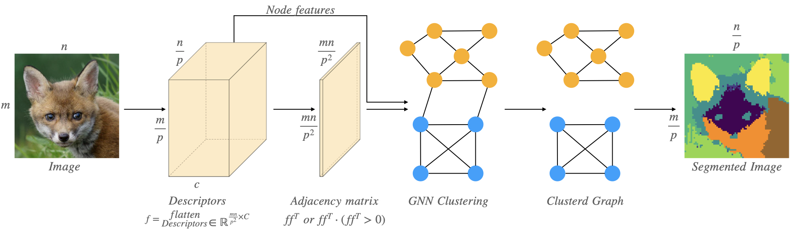
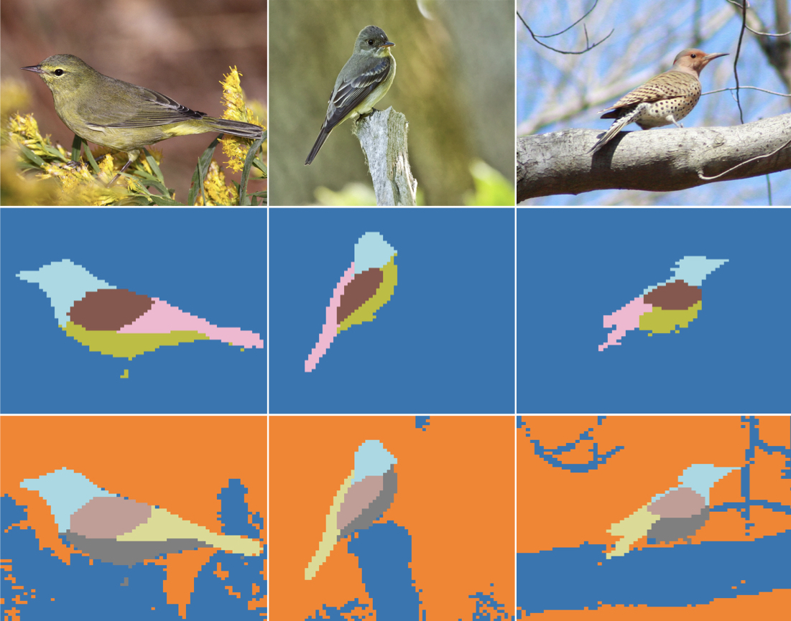

# DeepCut: Unsupervised Segmentation using Graph Neural Networks Clustering

<div align="center">

[](https://arxiv.org/abs/2212.05853)
[](https://sampl-weizmann.github.io/DeepCut/)
</div>



This code accompanies the paper Deep-Cut: Unsupervised-GNN-Segmentation.

## Abstract
Image segmentation is a fundamental task in computer vision.
Data annotation for training supervised methods can be labor-intensive, motivating unsupervised methods.
Some existing approaches extract deep features from pre-trained networks and build a graph to apply classical clustering methods (e.g., k-means and normalized-cuts) as a post-processing stage. 
These techniques reduce the high-dimensional information encoded in the features to pair-wise scalar affinities.
In this work, we replace classical clustering algorithms with a lightweight Graph Neural Network (GNN) 
trained to achieve the same clustering objective function.
However, in contrast to existing approaches, we feed the GNN not only the pair-wise affinities between local image features but also the raw features themselves.
Maintaining this connection between the raw feature and the clustering goal allows to perform part semantic segmentation implicitly, without requiring additional post-processing steps.
We demonstrate how classical clustering objectives can be formulated as self-supervised loss functions for training our image segmentation GNN.
Additionally, we use the Correlation-Clustering (CC) objective
to perform clustering without defining the number of clusters (k-less clustering).
We apply the proposed method for object localization, segmentation, and semantic part segmentation tasks, surpassing state-of-the-art performance on multiple benchmarks.

## How to run?
### Google colab
[](https://colab.research.google.com/drive/1LTz2TuQChWCGC_q5wiTUPFPmG1Fl30SS?usp=sharing)

### Requirements:
This code requirements are stated at ```requirements.txt```

### Project structure:
```./images```: Example images.  
```Segment.py``` : Main function, includes all parameters of various modes.  
```example.ipynb```: Interactive notebook with a running example.  
```gnn_pool.py```: Normalized-cut GNN pooling operator implementation in pytorch.   
```gnn_pool_cc.py```: Correlation-Clustering GNN pooling operator implementation in pytorch.  
```extractor.py```: Deep features extraction from pretrained transformer.  
```mat_extract```: Deep features extraction and manipulation to create image graph.  
```vision_transformers.py```: Pytorch implementation of VIT.  
```util.py```: Project utilities.  
```bilateral_solver.py```: Implementation of *Barron, Jonathan T., and Ben Poole* [**"The fast bilateral solver"**](https://arxiv.org/abs/1511.03296) ECCV 2016.  


## Examples:


